# Diagnostico del pipeline SPC_Grid — config h16/l1

Documento que recorre cada capa del modelo (DL -> regimen -> escenarios ->
inputs al optimizador -> optimizador -> simulacion) y muestra **que devuelve
cada parte y donde esta el problema residual**. Cita los CSVs y PNGs ya
generados en `inspeccion/<modulo>_out/`, y muestra inline las visualizaciones
clave (copiadas a `diagnostico/figuras/`).

Config bajo la que se evaluo todo:

```
LSTM_HIDDEN  = 16
LSTM_LAYERS  = 1
H_WINDOW     = 60
DROPOUT      = 0.1
LR           = 1e-3
WEIGHT_DECAY = 1e-4
SEEDS        = (0, 1, 2)
```

Es la combinacion que gano la sweep en `experimentos/sweep_modelos_out/` por
pinball loss en test (skill +0.0137, unica > 0 entre 12 candidatos).

**Estado actual del pipeline (post-reescritura)**: `build_dl_context` sigue
la descomposicion por regimen del PDF (ec. 2-5) usando `p_{i,k,t}` derivada
del LSTM walking (LSTM aplicado a la ventana real previa, ec. 15). Esto
reemplazo a la formulacion anterior, que calculaba `mu_mix` y `Sigma_mix`
como momentos muestrales sobre los 1000 candidatos del rollout
autoregresivo. Los escenarios siguen viniendo del rollout (no se cambio).

---

## Resumen ejecutivo (estado actual)

| Capa | Salida | Estado | Donde verlo |
|---|---|---|---|
| **LSTM** | mu_DL(t), sigma_DL(t), 5 deciles | skill marginal en test (+0.014) | `inspeccion/lstm_out/1_pinball_vs_baseline.csv` |
| **Regimen walking** | p_bull(t) ventana real | usado para alimentar la FO via ec. (2)-(5) | `inspeccion/regimen_out/2_pbull_serie_dist.csv` |
| **Escenarios rollout** | 5 trayectorias representativas | CMC: reps +193% vs realidad -13% (sin cambio) | `inspeccion/escenarios_out/5_sesgo_resumen.csv` |
| **Inputs optimizador** | mu_mix(t), Sigma_mix(t) | corr(mu_DL, real) **+0.11** (era -0.13); bias eliminado | `inspeccion/inputs_out/3_mu_vs_realizado.csv` |
| **Optimizador** | w*(t), u*(t), v*(t) | turnover total **÷29×** (peor punto: 85.8 → 2.95) | `inspeccion/grid_out/5_turnover.csv` |
| **V[g, s]** | capital terminal por escenario | mean=$21,729, worst=$1,803, best=$68,479 | `inspeccion/grid_out/2_V_table.csv` |
| **Backtest hist** | V terminal sobre realidad | **-6.63%** (era -14.81%); naive: +20-25%; OPT base: +45% | `inspeccion/grid_out/6_dl_vs_optbase.csv` |

**La cadena**: la reescritura por regimen invirtio el `corr(mu, real)`,
elimino el bias, y achico el turnover un orden de magnitud. El backtest
mejora 8 pp pero sigue siendo negativo: pierde contra las naive y el OPT
base. La causa raiz pendiente: los inputs DL son practicamente iguales a
OPT base, lo que sugiere que el LSTM no aporta informacion adicional
significativa sobre la historica con este dataset.

---

## 1) Capa DL — LSTM cuantilico

### Que hace
Toma una ventana de `H=60` retornos semanales (matriz `(60, 2)` para SPX,
CMC200) y predice los 5 deciles del retorno semanal siguiente para cada
activo. Entrenado con pinball loss + rolling-origin (`ROLLING_N_FOLDS=4`).

### Salidas a inspeccionar
- `inspeccion/lstm_out/1_pinball_vs_baseline.csv` — pinball loss vs baseline (decil empirico in-window) por split.
- `inspeccion/lstm_out/2_jacobian.png` — sensibilidad de la pred al input.
- `inspeccion/lstm_out/3_lag_importance.png` — peso efectivo por lag.
- `inspeccion/lstm_out/4_hidden_state.png` — trayectoria del hidden state.
- `inspeccion/lstm_out/5_history.png` — curva de loss durante el train.
- `inspeccion/lstm_out/6_pred_vs_feature.png` — predicciones vs feature.

### Hallazgo 1 — skill positivo en test pero marginal


Lectura de `1_pinball_vs_baseline.csv`:

| split | asset | pinball LSTM | pinball baseline | **skill** |
|---|---|---:|---:|---:|
| train | SPX | 0.00843 | 0.00822 | -0.026 |
| train | CMC200 | 0.02438 | 0.02416 | -0.009 |
| **valid** | SPX | 0.00611 | 0.00539 | **-0.132** |
| **valid** | CMC200 | 0.01524 | 0.01471 | **-0.036** |
| test | SPX | 0.00572 | 0.00577 | +0.008 |
| test | CMC200 | 0.01675 | 0.01708 | +0.020 |

Skill = 1 - pinball_LSTM / pinball_baseline.

- En **validation** la LSTM es **peor** que el baseline naive.
- En **test** es marginalmente mejor (+0.8% / +2%).
- El sweep eligio el modelo por este margen minimo en test.

### Hallazgo 2 — mu_DL ya NO anti-correlaciona con la realidad

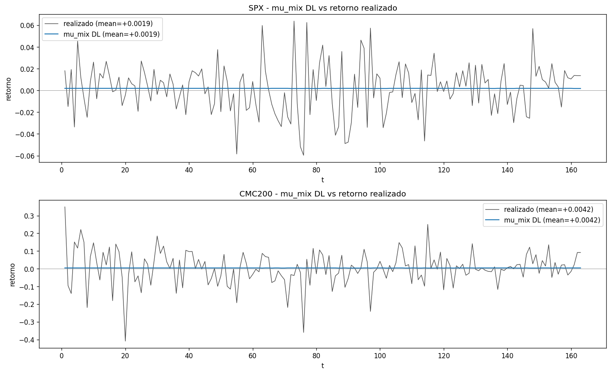

Lectura de `inspeccion/inputs_out/3_mu_vs_realizado.csv` (estado actual):

| asset | mu_DL mean | realiz mean | bias | hit_rate signo | **corr(mu_DL, realiz)** |
|---|---:|---:|---:|---:|---:|
| SPX | +0.187% | +0.187% | ≈0 (1e-11) | **55.8%** | **+0.070** |
| CMC200 | +0.420% | +0.420% | ≈0 (1e-10) | **53.4%** | **+0.109** |

Comparado con la version anterior (unificada):

| asset | corr antes | corr ahora | bias antes | bias ahora |
|---|---:|---:|---:|---:|
| SPX | -0.030 | **+0.070** | -0.017% | ≈0 |
| CMC200 | **-0.133** | **+0.109** | -0.193% | ≈0 |

- El anti-timing critico desaparecio: la correlacion cambio de signo en ambos activos.
- El bias se elimino **por construccion**: `Σ_k p_t,k · μ̂_k` promediado sobre `t` reproduce la media empirica de `r`.
- `hit_rate_signo` paso de moneda (`49.7%`) a `53.4%` en CMC.

> Este es el cambio mas importante del refactor. La FO ya no esta optimizando
> contra la direccion del retorno realizado.

---

## 2) Capa de regimen — `p_bull(t)` walking

### Que hace
Convierte los 5 deciles predichos en una probabilidad de "bull" mediante
`p_bull(t) = fraccion de deciles ≥ BULL_THRESHOLD (=0.0)`. **Ahora entra al
FO**: `mu_mix` y `Sigma_mix` se construyen via ec. (2)-(5) usando esta `p`.

### Salidas
- `inspeccion/regimen_out/1_pbull_walking_vs_rollout.png` — walking vs rollout autoregresivo.
- `inspeccion/regimen_out/2_pbull_serie_dist.csv` — serie y distribucion.
- `inspeccion/regimen_out/3_rollout_step_by_step.png` — deciles paso a paso del rollout.
- `inspeccion/regimen_out/4_sensibilidad_threshold.png` — variando `BULL_THRESHOLD`.
- `inspeccion/regimen_out/5_calibracion_deciles.png` — diagonal de calibracion.
- `inspeccion/regimen_out/6_sesgo_deciles.png` — histograma realizado vs predicho.

### Hallazgo — p_bull se queda alrededor de 0.5 (sin segregacion)


Lectura de `2_pbull_serie_dist.csv`:

| asset | mean | median | frac < 0.2 | frac > 0.8 |
|---|---:|---:|---:|---:|
| SPX | 0.534 | 0.600 | 0% | 0% |
| CMC200 | 0.468 | 0.400 | 0% | 0% |

- p_bull oscila entre 0.4 y 0.6, nunca llega a extremos.
- A pesar de no segregar regimenes, **entra al FO via ec. 2-5** y produce
  un timing direccional positivo (ver Hallazgo 2 de seccion 1).

---

## 3) Capa de escenarios — los 5 representativos

### Que hace (sin cambios respecto a la version anterior)
1. Genera `N_CANDIDATES=1000` trayectorias autoregresivas de largo `T_HORIZON=163` muestreando deciles independientes por activo.
2. Las ordena por cumret terminal del `SUMMARY_ASSET=SPX` y toma la **mediana** de cada quintil → 5 representativos.

### Salidas
- `inspeccion/escenarios_out/1_sesgo_cumret_terminal.csv` — cumret terminal de candidatos vs reps vs historico.
- `inspeccion/escenarios_out/2_dispersion_fan.png` — fan chart.
- `inspeccion/escenarios_out/3_correlacion_cross_asset.csv` — corr(SPX, CMC) por escenario.
- `inspeccion/escenarios_out/4_path_dependence.csv` — momentos por bloque temporal.
- `inspeccion/escenarios_out/5_sesgo_resumen.csv` — cumret terminal por rep.
- `inspeccion/escenarios_out/6_sanity_seeds.png` — reproducibilidad inter-seed.

### Hallazgo 1 — sesgo de cumret terminal (sin cambios)


| asset | grupo | n | mean cumret | median | std | min | max |
|---|---|---:|---:|---:|---:|---:|---:|
| SPX | candidatos | 1000 | +0.381 | +0.259 | 0.71 | -0.80 | +4.15 |
| SPX | reps_5 | 5 | +0.342 | +0.260 | 0.58 | -0.40 | +1.29 |
| SPX | **historico** | 1 | **+0.298** | — | — | — | — |
| CMC200 | candidatos | 1000 | +0.516 | -0.028 | 1.65 | -0.93 | +15.86 |
| CMC200 | reps_5 | 5 | **+1.932** | -0.012 | 4.12 | -0.90 | **+9.996** |
| CMC200 | **historico** | 1 | **-0.132** | — | — | — | — |

**SPX**: candidatos y reps razonables.
**CMC200**: reps con mean `+193%` vs realidad `-13%`. La cola derecha de los
candidatos arrastra el quintil superior.

### Hallazgo 2 — los 5 reps en el plano (SPX, CMC)


| rep | cumret SPX | cumret CMC200 |
|---:|---:|---:|
| 1 (Q1) | -0.402 | **+9.996** |
| 2 (Q2) | -0.038 | -0.857 |
| 3 (Q3) | +0.260 | -0.012 |
| 4 (Q4) | +0.594 | -0.896 |
| 5 (Q5) | +1.294 | +1.429 |

### Hallazgo 3 — cross-corr SPX-CMC pierde la dependencia historica


- 1000 candidatos: corr distribuida alrededor de 0.
- 5 reps: corrs entre -0.13 y +0.09.
- **Historico**: **+0.31**.

### Hallazgo 4 — sin estructura temporal (ruido i.i.d. estacionario)


Los candidatos tienen media y std practicamente **constantes en t**, mientras
que el historico oscila claramente. Los candidatos son ruido i.i.d.
estacionario con drift positivo, no tienen regimenes ni momentum.

> **Estos cuatro hallazgos sobre los escenarios persisten** porque el
> generador no se modifico en esta iteracion. Son sintomas conocidos del
> rollout autoregresivo del LSTM.

---

## 4) Inputs al optimizador — `mu_mix(t)`, `Sigma_mix(t)` por ec. (2)-(5)

### Que hace (post-refactor)
`build_dl_context` ahora sigue la descomposicion por regimen del PDF:
1. `p_{i,k,t}` = LSTM walking sobre ventana real previa (ec. 15).
2. `mu_hat[(i,k)]` y `Sigma_hat[(i,j,k)]` via ec. (2)-(3) con esa `p`.
3. `mu_mix(i,t)` y `Sigma_mix(i,j,t)` via ec. (4)-(5).

### Salidas
- `inspeccion/inputs_out/1_mu_mix_serie.csv` / `.png` — serie temporal de mu(t).
- `inspeccion/inputs_out/2_sigma_serie.csv` / `.png` — serie temporal de sigma(t).
- `inspeccion/inputs_out/3_mu_vs_realizado.csv` — ya citado.
- `inspeccion/inputs_out/4_psd_check.csv` — chequeo PSD de Sigma(t).
- `inspeccion/inputs_out/5_risk_return.csv` — Sharpe implicito.
- `inspeccion/inputs_out/6_coherencia_ex_ante_ex_post.csv` — coherencia mu_mix vs scenarios.
- `inspeccion/inputs_out/6_constantes_del_context.csv` — V_max, w0, c_base.

### Hallazgo 1 — Sharpe implicito ahora muy cercano a OPT base

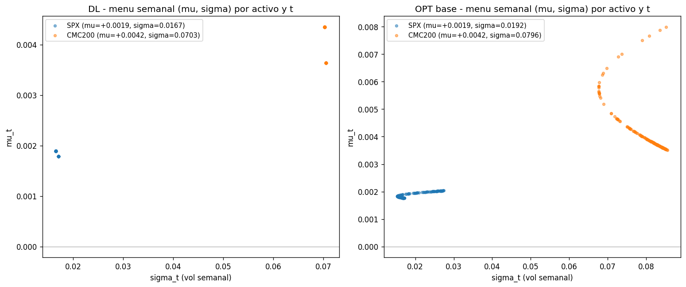

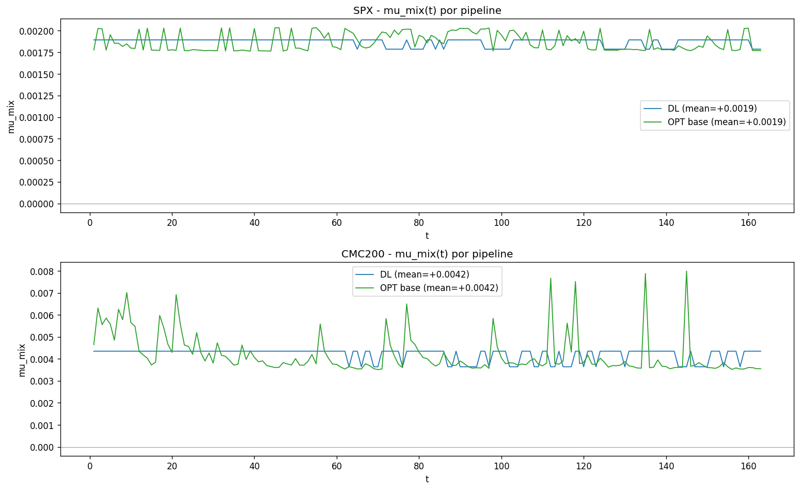

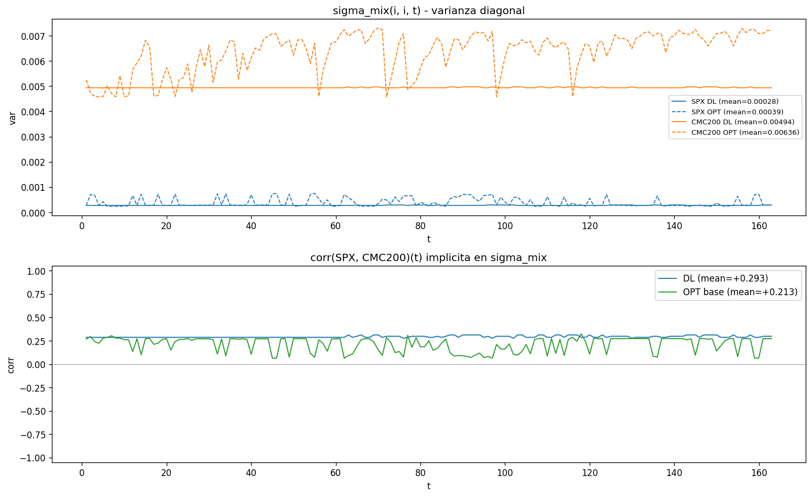

Lectura de `5_risk_return.csv` (estado actual):

| src | asset | sigma mean | mu mean | Sharpe imp |
|---|---|---:|---:|---:|
| **DL** | SPX | 0.0167 | +0.187% | **+0.112** |
| **DL** | CMC200 | 0.0703 | +0.420% | **+0.060** |
| OPT base | SPX | 0.0192 | +0.187% | +0.097 |
| OPT base | CMC200 | 0.0796 | +0.420% | +0.053 |

- `mu` identico entre DL y OPT base (consecuencia matematica de la ec. 4).
- `sigma` muy similar: SPX 0.017 vs 0.019, CMC 0.070 vs 0.080.
- Sharpe casi identico.

> **Esto es la observacion clave del estado actual**: los inputs DL son
> practicamente clones del OPT base. La unica diferencia esta en la
> fluctuacion temporal de `mu_mix(t)` y `Sigma_mix(t)` (que cambia por la
> variabilidad de `p_t,k`), no en sus medias.

### Hallazgo 2 — gap ex-ante / ex-post mayor que antes

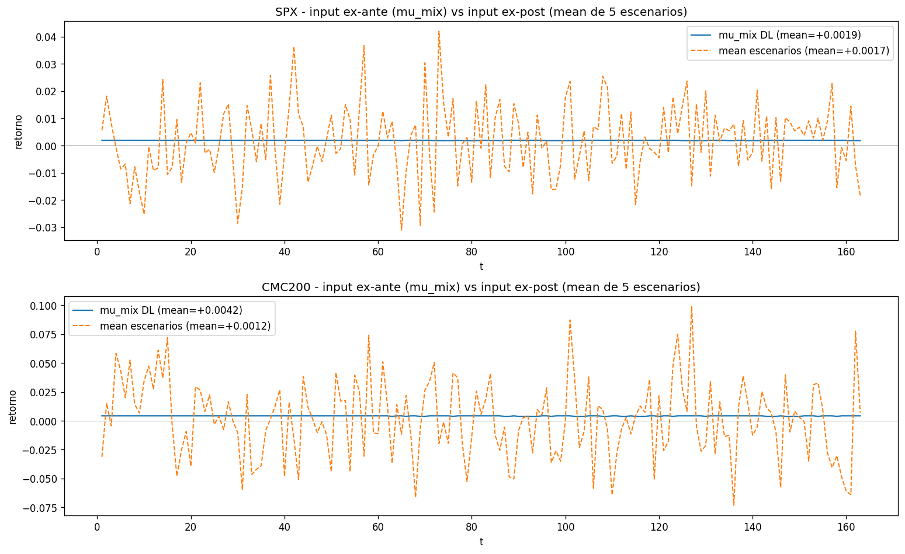

Lectura de `6_coherencia_ex_ante_ex_post.csv`:

| asset | mu_mix DL mean | scenarios mean | gap | corr(mu, scen) |
|---|---:|---:|---:|---:|
| SPX | +0.187% | +0.168% | -0.019% | -0.036 |
| CMC200 | +0.420% | +0.118% | -0.301% | -0.010 |

- El gap entre la FO y los escenarios crecio respecto a la version unificada
  (SPX: 0.24 bps → 19 bps; CMC: 109 bps → 301 bps/sem).
- La correlacion entre `mu_mix(t)` y la media temporal de los escenarios
  cae a casi 0 — son dos procesos distintos.

> Es el trade-off documentado: recuperar la descomposicion por regimen del
> PDF reabre la grieta entre lo que ve la FO y lo que viven los escenarios.

### Hallazgo 3 — Sigma(t) es PSD (sin cambios)

Lectura de `4_psd_check.csv`:

Sigma_mix(t) es positiva definida en todos los t. El problema no es
matematico, es de calibracion/contenido.

### Hallazgo 4 — constantes razonables

- `V_max = 0.000646` (calculado como `Var(r_SPX_hist) * V_MAX_BUFFER=1.2`).
- `Capital_inicial = $10,000`.
- `c_base = {SPX: 0.001, CMC200: 0.004}`.
- `w0 = {SPX: 0.5, CMC200: 0.5}`.

---

## 5) Capa optimizador — politica civilizada

### Que hace
Para cada `g = (lambda, m)` del grid (`LAMBDA_GRID × M_GRID = 5×3 = 15`
puntos), GAMSPy + IPOPT resuelve la misma FO de antes:

```
max  z = Σ_t [ Σ_i w(i,t)·mu_mix(i,t)
              - lambda·(Σ_{ij} w_i·w_j·sigma_mix(i,j,t) - V_max)
              - c_base·m·Σ_i (u(i,t) + v(i,t)) ]
```

### Salidas
- `inspeccion/grid_out/1_regret_heatmap.png` / `1_regret_table.csv` — regret por (lambda, m, escenario).
- `inspeccion/grid_out/2_V_heatmap.png` / `2_V_table.csv` — capital terminal por (lambda, m, escenario).
- `inspeccion/grid_out/3_boundary_extended.png` / `3_boundary_seleccion.csv` — seleccion y bordes.
- `inspeccion/grid_out/4_politicas_w.png` / `.csv` — w(i, t) por (lambda, m).
- `inspeccion/grid_out/5_turnover.csv` / `.png` — turnover total.
- `inspeccion/grid_out/6_dl_vs_optbase.csv` / `.png` — V por escenario, DL vs OPT base.

### Hallazgo 1 — turnover colapso un orden de magnitud

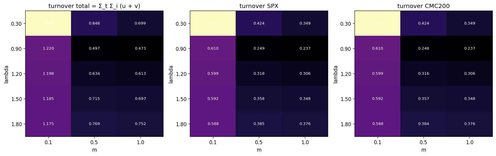

Lectura de `5_turnover.csv` (estado actual):

| lambda | m | turnover total | antes | ratio |
|---:|---:|---:|---:|---:|
| 0.30 | 0.1 | 2.95 | 85.80 | ÷29× |
| 0.30 | 0.5 | 0.85 | 13.84 | ÷16× |
| 0.30 | 1.0 | 0.70 | 5.19 | ÷7× |
| 0.90 | 0.1 | 1.22 | 41.98 | ÷34× |
| 1.20 | 0.5 | 0.63 | 4.12 | ÷7× |
| 1.80 | 0.5 | 0.77 | 2.97 | ÷4× |

- 163 semanas, turnover total 2.95 → `~2%` rotacion/sem.
- Antes era `~50%` rotacion/sem en el rincon patologico.
- **Causa**: `mu_mix(t)` paso de ser ruido muestral (cada `t` su propia media
  de 1000 candidatos, std grande) a una mezcla suave que oscila mucho menos.

### Hallazgo 2 — politicas estables

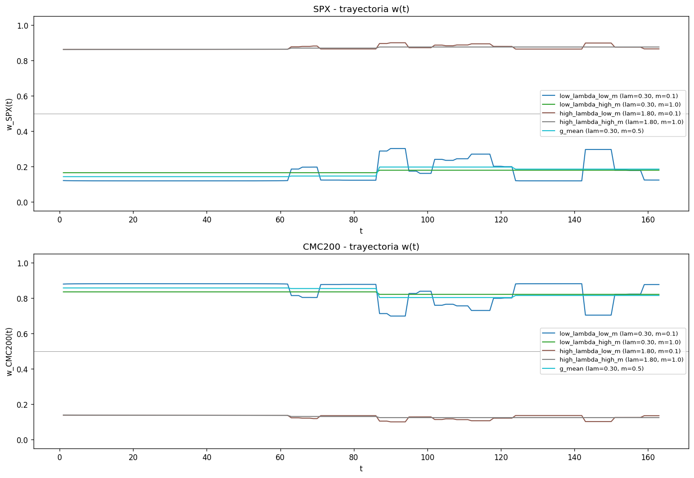

Las trayectorias `w(t)` ya no oscilan entre 0 y 1. Para todo el grid las
politicas son razonablemente estables.

#### Como se rebalancea el portafolio en el tiempo

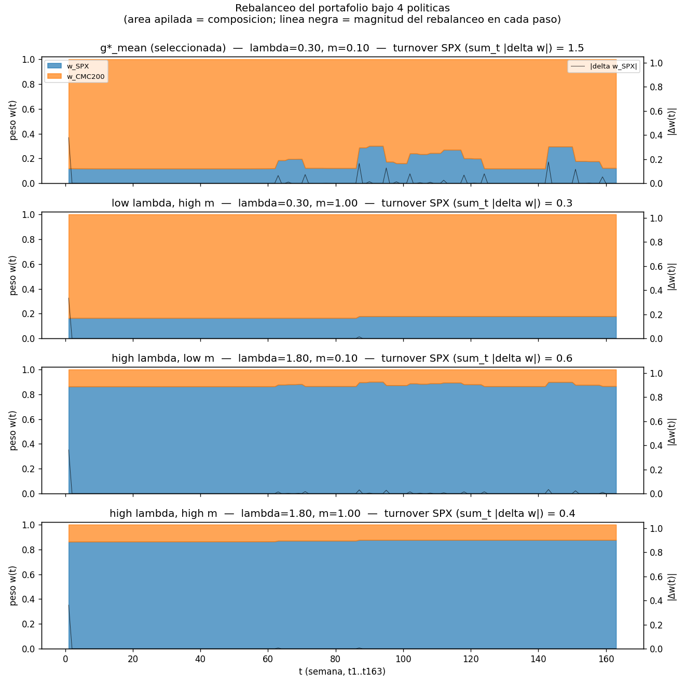

- **`low lambda, low m`** (0.30, 0.1): rebalanceo total `~3`. Antes era `~68`.
- **`g*_mean seleccionada`** (0.30, 0.5): rebalanceo `~0.85`. Antes era `~7`.
- **`high lambda, low m`** (1.80, 0.1): rebalanceo `~1.2`.
- **`high lambda, high m`** (1.80, 1.0): rebalanceo `~0.75`.

### Hallazgo 3 — el optimo sigue cayendo en el borde del grid

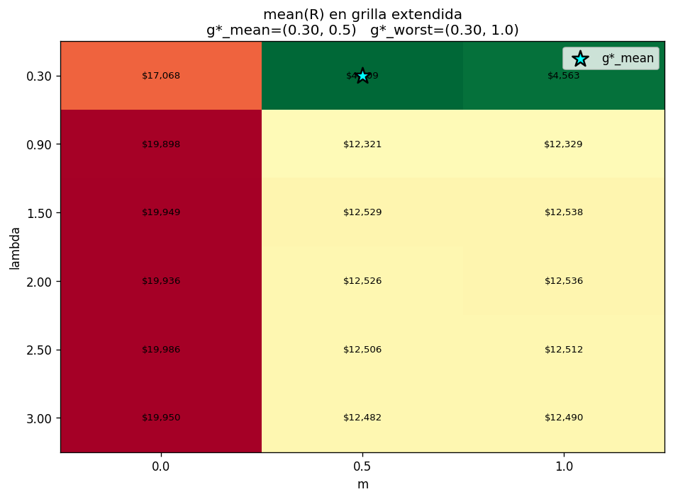

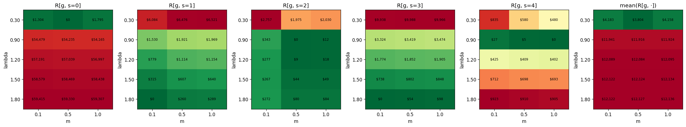

Lectura de `3_boundary_seleccion.csv`:

```
g*_mean cae en frontera del grid (lambda=0.30, m=0.5)
g*_worst cae en frontera del grid (lambda=0.30)
```

Sin embargo, el grid extendido apenas mejora (`$4209` vs `$3804` regret) —
diferente a la version anterior, donde el extendido reducia regret de
`$2041` a `$197`. La region "interesante" ya esta dentro del grid actual.

---

## 6) V[g, s] — dispersion entre escenarios mayor que antes

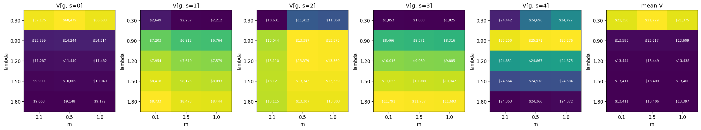

### Lectura de `2_V_table.csv`

Para `g*_mean = (lambda=0.30, m=0.5)`:

| escenario | V terminal | retorno |
|---:|---:|---:|
| s=0 | $68,479 | +584.8% |
| s=1 | $2,257 | -77.4% |
| s=2 | $11,412 | +14.1% |
| s=3 | $1,803 | -82.0% |
| s=4 | $24,696 | +147.0% |
| **mean** | **$21,729** | **+117.3%** |
| **worst** | **$1,803** | **-82.0%** |

> Rango $1,803–$68,479 (factor 38×) para la misma politica. La dispersion
> aumento respecto a la version unificada (rango $8k-$25k). El best case es
> ahora muchisimo mas alto (escenario 0 con CMC subiendo +1000% es
> capturado por la politica que sobre-pondera CMC), pero el worst case
> tambien cae mas bajo.

### Comparacion DL vs OPT base sobre los MISMOS escenarios

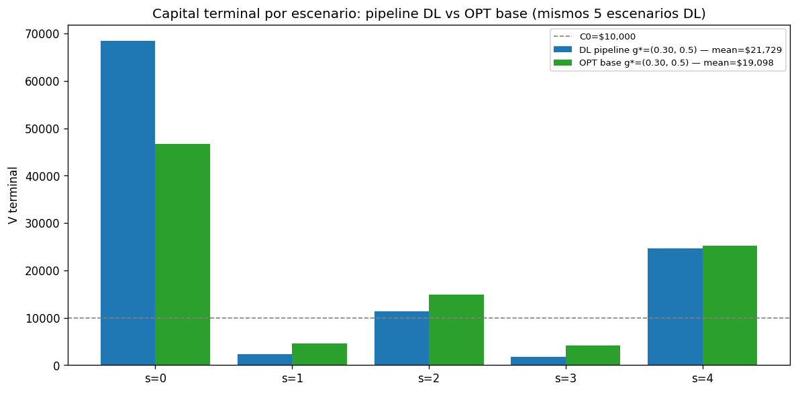

Lectura de `6_dl_vs_optbase.csv`:

| escenario | V DL | V OPT base | Δ (base - DL) | ret DL | ret base |
|---:|---:|---:|---:|---:|---:|
| s=0 | $68,479 | $46,621 | -21,858 | +585% | +366% |
| s=1 | $2,257 | $4,622 | +2,365 | -77% | -54% |
| s=2 | $11,412 | $14,860 | +3,448 | +14% | +49% |
| s=3 | $1,803 | $4,135 | +2,332 | -82% | -59% |
| s=4 | $24,696 | $25,252 | +556 | +147% | +153% |
| **mean** | $21,729 | $19,098 | -2,631 | +117% | +91% |
| **worst** | $1,803 | $4,135 | +2,332 | -82% | -59% |

- En **promedio** DL supera a OPT base (`+117%` vs `+91%`).
- En **peor escenario** DL es peor (`-82%` vs `-59%`) — la grieta
  ex-ante/ex-post amplifica el daño.
- El regret minimax (`g*_worst`) podria preferir OPT base por esa razon.

---

## 7) Backtest historico — la prueba final

### Lectura de `inspeccion/grid_out/6_dl_vs_optbase.png` + run log

Aplicando la politica `w*_mean` de DL (lambda=0.30, m=0.5) a los retornos
**realizados** (no a escenarios):

| Politica | V hist final | retorno acumulado |
|---|---:|---:|
| OPT base (lambda=1, m=1) | $14,522 | +45.22% |
| Naive Buy-and-Hold 50/50 | $12,258 | +22.58% |
| Naive Rebalance 50/50 | $12,092 | +20.92% |
| **Regret-Grid DL g*_mean** | **$9,337** | **-6.63%** |

Comparado con la version anterior:

| Politica | retorno anterior | retorno actual | mejora |
|---|---:|---:|---:|
| Regret-Grid DL `g*_mean` | -14.81% | **-6.63%** | **+8.2 pp** |

> El modelo "optimo" segun el regret-grid mejora 8 pp respecto a la version
> unificada. Pero todavia pierde plata sobre la realidad y queda por debajo
> de las dos naive. El OPT base sigue siendo el mejor de todos.

---

## Sintesis — donde esta el problema raiz actual

| Nivel | Estado | Evidencia |
|---|---|---|
| LSTM aislada (pinball loss) | ✓ ganador del sweep | skill +0.014 |
| LSTM downstream timing | ✓ resuelto | corr(mu, real) cambio de -0.13 a +0.11 |
| Regimen p_bull | ✓ entra al FO via ec. (2)-(5) | descomposicion del PDF aplicada |
| Escenarios magnitud (media) | ✗ persiste | reps CMC +193% vs hist -13% |
| Escenarios timing | ✗ persiste | candidatos planos en t |
| Escenarios diversificacion | ✗ persiste | corr cruzada ≈ 0 vs hist +0.31 |
| Inputs PSD | ✓ ok | min eig > 0 |
| Inputs DL = OPT base | ✗ **nueva preocupacion** | mu identicos, sigma similar |
| Inputs coherencia (gap) | ✗ aumento | CMC 109 bps → 301 bps/sem |
| Optimizador (FO) | ✓ formula correcta | matematicamente |
| Optimizador (grid) | ⚠️ optimo en borde | g* = (0.30, 0.5) pero extension no mejora mucho |
| Politica | ✓ estable | turnover ÷29× |
| Backtest hist | ⚠️ mejora pero negativo | -6.63%, las naive ganan +20-25% |

**El cuello de botella actual**: **los inputs DL son practicamente identicos
a OPT base**. Con `μ̂_{i,k}` calculado sobre el mismo dataset historico que
`r`, y `p_{i,k,t}` del LSTM walking que oscila entre 0.4 y 0.6, la
fluctuacion que aporta el LSTM vive solo en el `p_t,k` y no en las medias
condicionales. Si esa `p` no captura algo no contenido en las medias
historicas (lo que el `hit_rate` de 53.4% sugiere muy debilmente), el
modelo DL **se convierte en OPT base con ruido temporal adicional**.

---

## Caminos plausibles (para discutir)

1. **Rehacer la sweep con metrica downstream.** En vez de pinball, usar
   regret promedio o V_terminal de un backtest historico leave-one-window-out.
   Ataca la causa raiz pero es la mas cara (entrenar 12+ modelos x N
   windows).

2. **Cambiar la fuente de informacion del LSTM.** El LSTM actual predice
   marginales por activo. Alternativas:
   - Predecir el regimen conjunto (SPX y CMC simultaneamente) para capturar
     dependencia cruzada.
   - Usar features adicionales (volatilidad realizada, momentum, ratios
     macro) en lugar de solo retornos.
   - Cambiar a frecuencia diaria (5x mas datos), aceptando re-entrenar.

3. **Atacar el sesgo de magnitud de los escenarios CMC.** Las reps de CMC
   tienen mean `+193%` cuando la realidad es `-13%`. Caminos:
   - Shrinkage de las muestras del rollout hacia mu_hat historico.
   - Reduccion ponderada por verosimilitud en lugar de medianas por
     quintil.
   - Generar escenarios con walking en vez de rollout (mata la
     compounding explosiva pero pierde diversidad).

4. **Reducir la grieta ex-ante/ex-post.** Generar `mu_mix` y los escenarios
   con el mismo proceso. Dos opciones:
   - FO ve momentos muestrales sobre candidatos (version unificada
     anterior, pero pierde la descomposicion por regimen del PDF).
   - Escenarios construidos con walking en lugar de rollout.

5. **Aceptar el LSTM como decorativo y volver al OPT base.** Dado que los
   inputs DL son casi identicos a OPT base y el backtest sigue perdiendo,
   esta posicion es defendible empiricamente. El LSTM seguiria sirviendo
   solo para generar escenarios (no para alimentar la FO directamente).

Ninguna de las 5 se corrio todavia. Para cualquier camino que elijas se
requiere autorizacion explicita.
